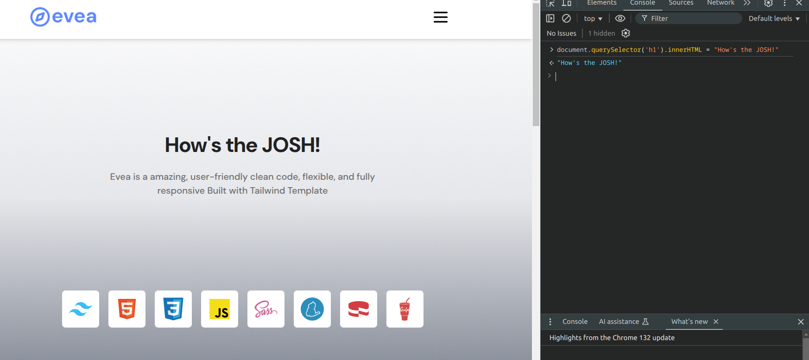

```javascript
document.querySelector('h1').innerHTML = "How's the JOSH!"
```

#### we can visit any site and put this code in the console, then all the h1 tag's content will be changed.

### Example:
