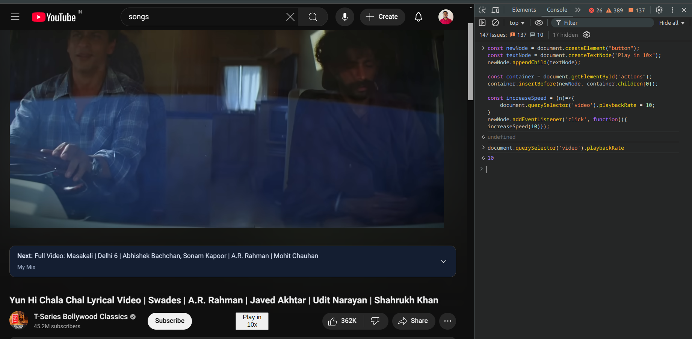

```javascript
const newNode = document.createElement("button");
const textNode = document.createTextNode("Play in 10x");
newNode.appendChild(textNode);

const container = document.getElementById("actions");
container.insertBefore(newNode, container.children[0]);

const increaseSpeed = (n)=>{
    document.querySelector('video').playbackRate = n;
}
newNode.addEventListener('click', function(){ increaseSpeed(10)});
```

### Example

